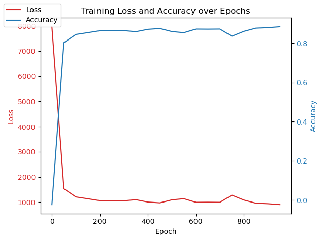
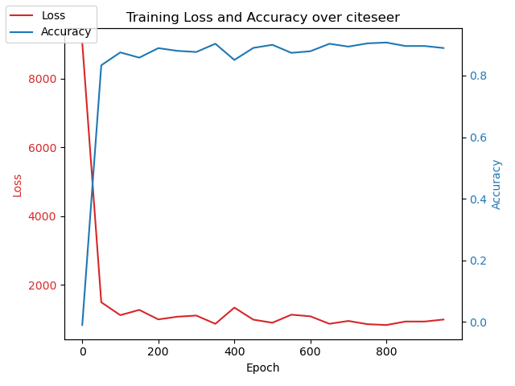
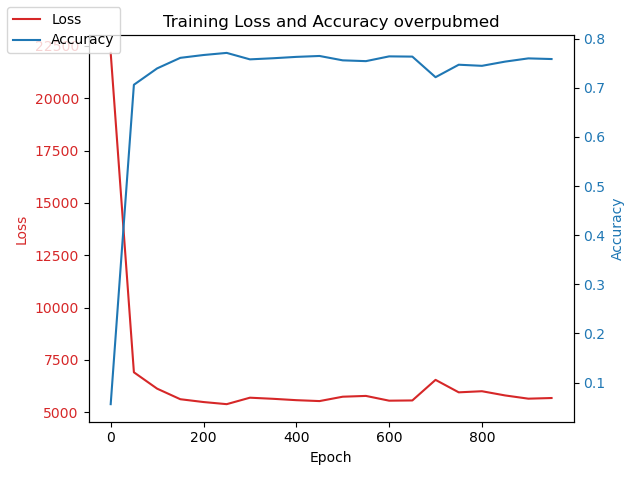
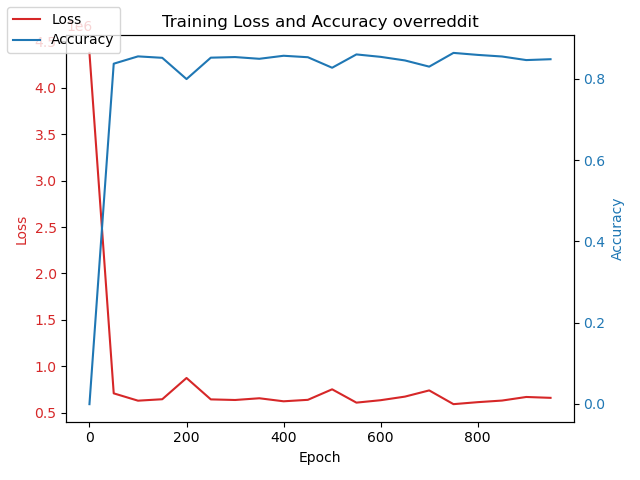

# HM 2
by Yufeng Guo

## install

by installation, follow the steps:
```

mkdir build && cd build
cmake ../
make
cp ./gra* ../hw2/
cp ./pytorch_apis.py ./hw2/
```

## model architecture
3 layer fully connected network:

with linear layer was implemented through our own CUDA kernel funtion

## Model runing && Result


# HW3 
## Environment Setup:
NVCC:11.8, Nvidia A100
```

conda create -n dgl python=3.7
conda install pytorch==1.6.0 torchvision==0.7.0 cudatoolkit=10.2 -c pytorch
pip install dgl-cu102==0.6.1
```

By installation, follow steps in HW2

## Graph and Kernel Implementation
- Graph structures was decleared : [csr.h](https://github.com/misra0514/deep-codegen/blob/main/csr.h#L12) 
- spmm was implemented:[kernel.cu](https://github.com/misra0514/deep-codegen/blob/main/kernel.cu)
- backward part:[pytorch_apis.py](https://github.com/misra0514/deep-codegen/blob/main/pytorch_apis.py#L18)
- Model runnng && Testing:  [hw3/main.py]() && [hw3/model2.py]()

## Results
Model was trained in 
#### CORA

#### citeseer

#### pubmed

#### reddit
